# 盯盘侠 PanWatch · H5

> 移动端 H5 版本 · **莫兰迪配色** · 零构建零依赖 · 实时行情 + SQLite 持久化（可选后端）

基于 [jackhuo2/PanWatch](https://github.com/jackhuo2/PanWatch)（自托管 AI 盯盘助手）改造的**独立移动端 H5 应用**。
原项目是 `FastAPI 后端 + React 前端` 的重型自托管方案；本版把界面重做成一套**零依赖、零构建、可直接上边缘节点**的移动优先 H5。

**两种用法，同一份前端代码：**

| 模式 | 怎么跑 | 数据 |
|---|---|---|
| **纯静态**（默认） | 只部署静态资源 | 全部为内置演示数据，不联网 |
| **接后端** | 再加上随项目附带的 Cloudflare Worker + D1 | 行情来自腾讯财经，持仓/自选/提醒持久化在 D1 |

没探测到后端时自动回落到纯静态模式，行为与接后端前完全一致。
**顶栏始终标出当前数据是「实时」还是「演示」** —— 这两种数据长得一模一样，
不标出来就等于在误导。

---

## 它和原项目的关系

| | 原项目 PanWatch | 本项目 PanWatch H5 |
|---|---|---|
| 形态 | 自托管全栈应用 | 纯静态 H5，或 H5 + Cloudflare Worker/D1 |
| 技术栈 | Python FastAPI + React 18 + Tailwind + shadcn/ui | 原生 HTML / CSS / ES Module（后端为纯 JS Worker） |
| 构建 | `pnpm build`，产物需 Node 运行时 | **无需构建**，源文件即产物 |
| 部署 | Docker（需 Python 运行时、Playwright、数据库卷） | Cloudflare Workers（静态资源，或静态资源 + Worker + D1） |
| 数据 | 实时行情 + SQLite 持久化 | 默认内置演示数据；接后端后为腾讯财经实时行情 + D1（托管的 SQLite）持久化 |
| 配色 | 深色 + 蓝色主调 | **莫兰迪灰调**（浅色为主，附暗色变体） |
| 体积 | 镜像数百 MB | 纯静态约 90 KB；加后端多约 20 KB Worker 代码 |

**为什么不能直接把原项目部署到 Workers**：Workers 只跑 JavaScript/WASM。
原后端依赖 `SQLAlchemy` / `APScheduler` / `Playwright` / Python 运行时，
这些在 Workers 上都跑不起来。所以本项目**重新实现了后端**：一个纯 JS 的
Worker（4 个文件）+ D1，只做「代理行情 + 存数据」这两件事，
不试图复刻原项目的能力（见「实时行情与持久化」）。

---

## 截图

移动端（390 × 844）：

| 首页 | 持仓 | 个股 AI 分析 | 模拟盘 |
|---|---|---|---|
| 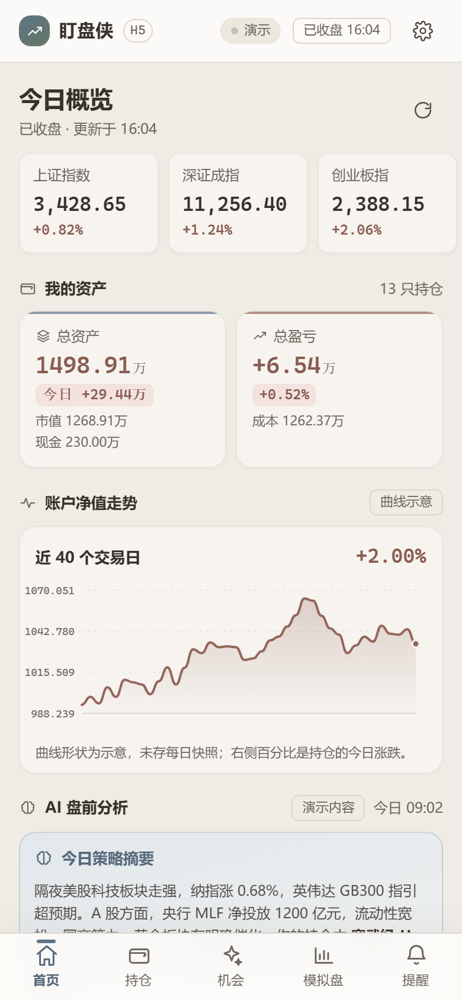 | 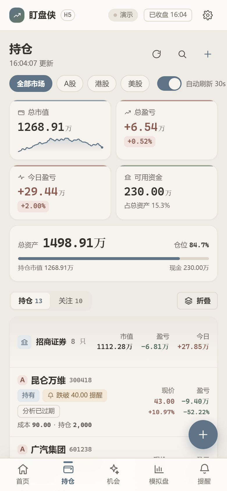 | 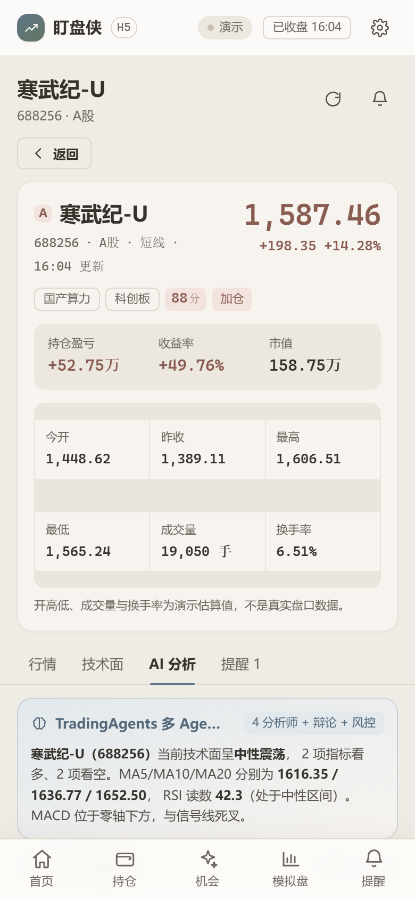 | 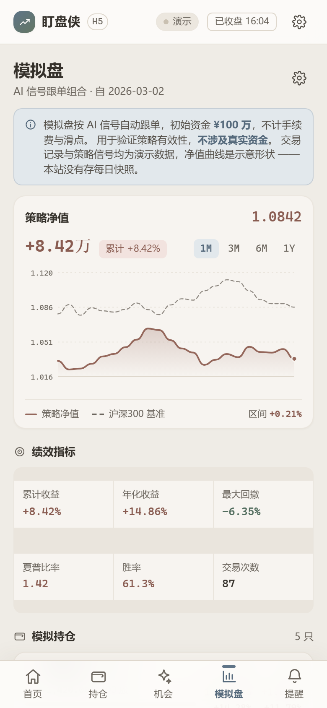 |

| 机会 | 提醒 | 新建提醒 | 设置（深色） |
|---|---|---|---|
| 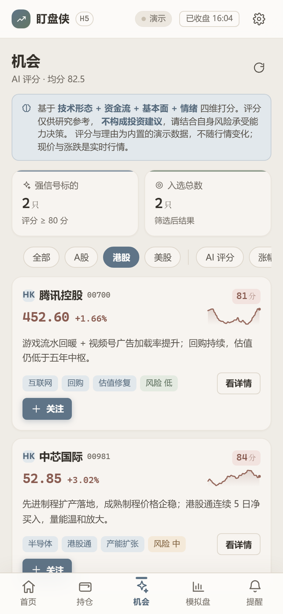 | 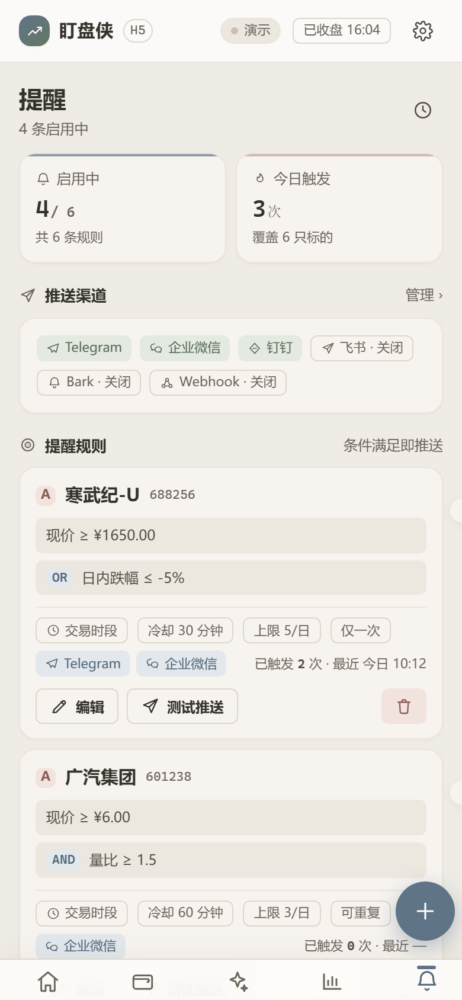 | 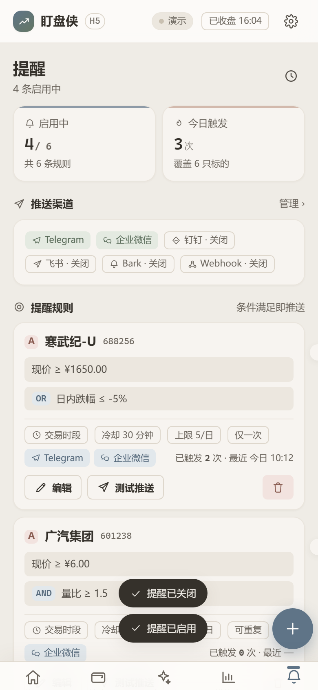 | 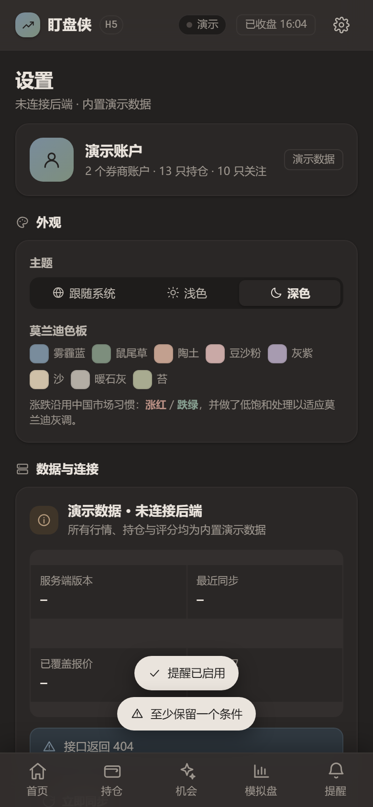 |

桌面端（1280 × 900，应用收窄居中）：

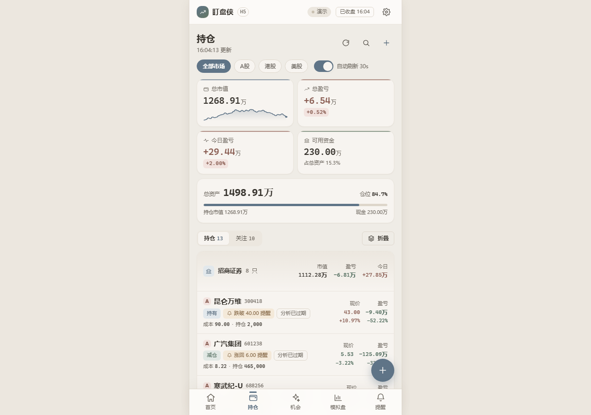

> 截图由 `node scripts/e2e.cjs` 在验证过程中自动产出，不是手工摆拍的。

设计规范页（`design/index.html`）：

| 概览 | 色彩 | 字体 | 组件 |
|---|---|---|---|
| 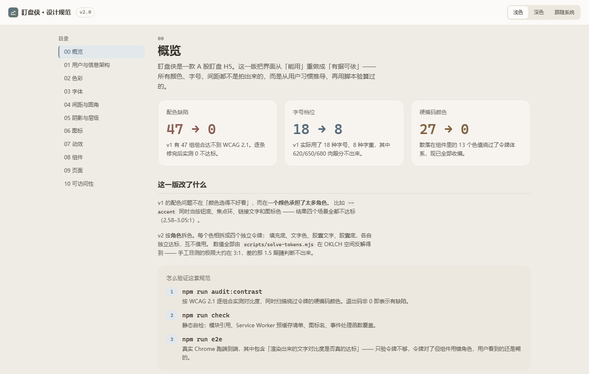 | 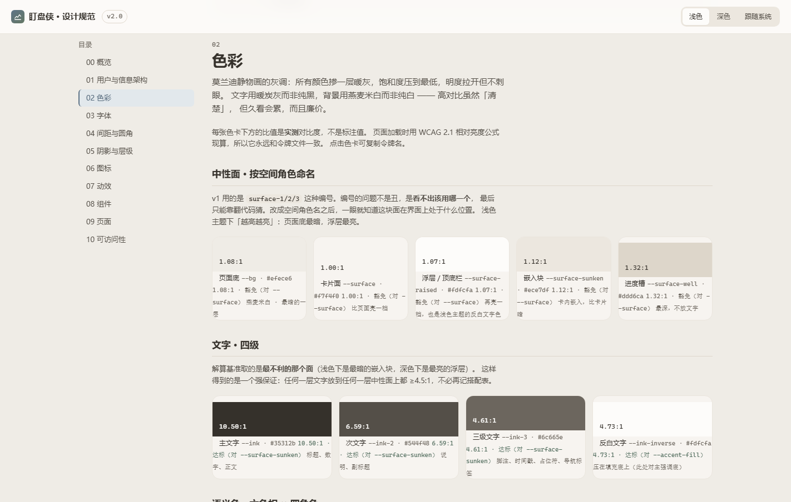 | 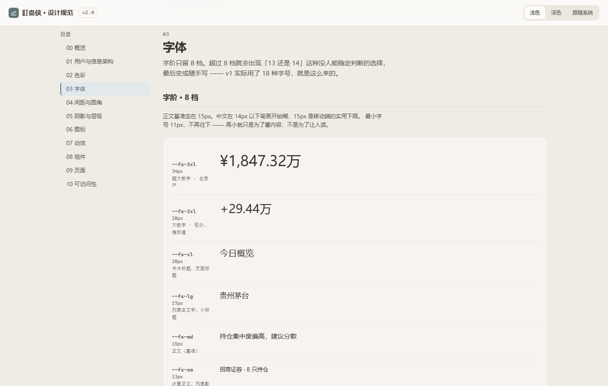 | 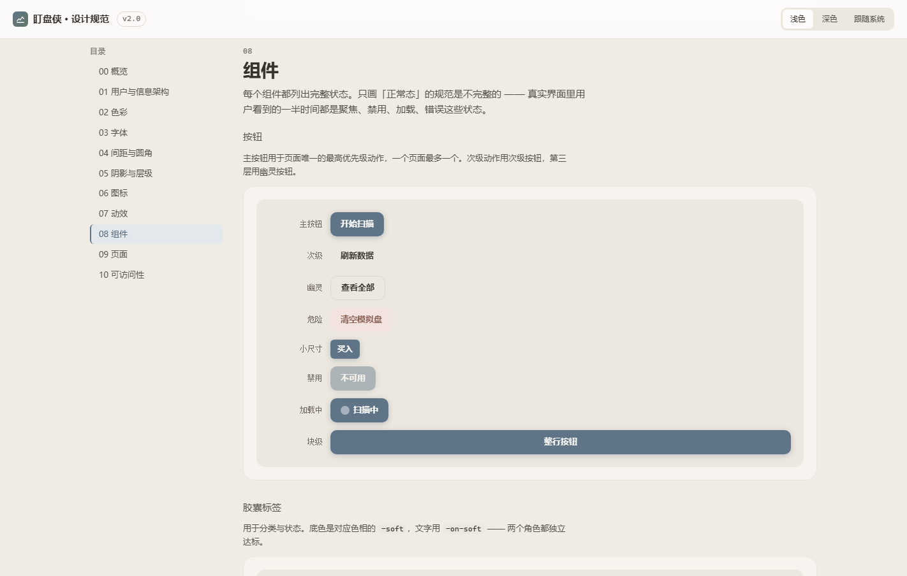 |

> 同样由 `node scripts/e2e-design.cjs` 自动产出。

---

## 功能

底部五个主入口，加一个个股详情页和一个设置页：

| 页面 | 内容 |
|---|---|
| **首页** | 六大指数横条、总资产/总盈亏卡、账户净值曲线、AI 盘前分析（含操作建议）、持仓异动、模拟盘速览、市场快讯 |
| **持仓** | 多账户汇总（招商 / 东方）、6 张指标卡、仓位占比进度条、持仓 13 只 / 关注 10 只分段切换、A股/港股/美股市场筛选、自动刷新开关 |
| **机会** | AI 四维评分选股 8 只，按评分 / 涨幅 / 风险排序，市场筛选，含评分理由与风险等级 |
| **模拟盘** | 策略净值曲线（对比基准，4 档时间区间）、6 项绩效指标（年化/回撤/夏普/胜率）、模拟持仓权重条、最近交易流水 |
| **提醒** | 6 条价格提醒规则，条件组合 AND/OR、生效时段、冷却时间、日触发上限、重复模式、多推送渠道，规则开关 |
| **个股详情** | 行情头 + 持仓盈亏横幅、K 线（MA5/10/20 + 成交量）、技术指标共振（MA/MACD/RSI/KDJ/BOLL 信号灯）、支撑压力位、TradingAgents 七步推理链 |
| **设置** | 主题切换、莫兰迪色板预览、后端 API 配置、6 个通知渠道开关、风险偏好、数据概览 |

### 交互细节

- 全部图表是**手写 SVG**（迷你走势图、K 线、净值曲线、环形图），零图表库
- 演示数据由**原始事实**（成本、持仓、现价、昨收）实时推导，市值 / 盈亏 / 涨跌幅永远不会自相矛盾
- 每只股票的走势序列用**代码作随机种子**生成，刷新不会乱跳
- 底部弹层支持动态增删提醒条件（最多 5 条，至少保留 1 条）
- 偏好（主题 / 筛选 / 渠道开关 / 风险偏好）写入 `localStorage`，路由切换不丢
- PWA：可「添加到主屏幕」，Service Worker 预缓存全部资源，断网可用

---

## 莫兰迪设计系统

色板取自莫兰迪静物画的灰调：**所有颜色都掺入一层暖灰，饱和度压低，明度拉开但不刺眼**。

完整的交互式规范在这里 —— 浏览器直接打开 `design/index.html`（或本地服务下的
`/design/index.html`）：11 个章节、色板可点击复制令牌名、对比度是**页面加载时现算的**，
所以它永远和 `css/tokens.css` 一致。

### 每个色相拆成四个角色

v1 的根因不是「颜色不好看」，而是**一个颜色同时干四份活**：既当填充底，又当文字色，
又当胶囊底，还当胶囊上的字。结果就是文字对比度全面不达标 —— 实测 47 处缺陷。

v2 把每个色相拆成四个独立令牌，各自独立达标：

```css
--up-fill     填充底（大色块，如涨跌条、K 线）
--up-text     文字色（正文里的涨跌数字）        ← 对最暗的面 ≥ 4.5:1
--up-on-soft  胶囊文字（浅底胶囊上的字）        ← 对自家 --up-soft ≥ 4.5:1
--up-soft     胶囊底（背景，不受文字标准约束）
```

色相沿用莫兰迪灰调：主强调雾霾蓝、次强调鼠尾草绿、涨/危险陶土红、跌/成功灰绿、
警示琥珀、灰紫；涨跌严格遵循中国市场习惯 —— **涨红跌绿**。

### 色值不是手调的，是解出来的

`scripts/solve-tokens.mjs` 在 OKLCH 空间里反解：固定色相与彩度，二分搜索明度，
取**刚好达标的最浅解** —— 既合规，又保住莫兰迪的柔感。

用 OKLCH 而不是 HSL，是因为 HSL 的 L 是混色比例而非感知明度：同样的 L 值，
黄色看着很亮、蓝色看着很暗，靠手调 L 拼出来的灰阶会一段发蓝一段发黄。

两档阈值也是分开的：正文 4.5:1（WCAG 1.4.3 AA），大字与图形文字 3:1。
混为一谈要么冤枉设计，要么放过缺陷。

### 实测结果

```
受判定组合  88    达标 88    不达标 0
装饰豁免     8
```

`scripts/audit-contrast.mjs` 会同时做两件事：按 WCAG 2.1 公式验算所有前景/背景组合，
以及扫描**令牌泄漏** —— 绕过 `tokens.css` 的硬编码颜色。判据是「没名字的颜色改不动」。

装饰性元素（分隔线、进度槽）按 WCAG 1.4.11 豁免，判据是
「该元素消失后信息是否仍完整？」。但输入框和开关的描边承载「可操作」语义，
所以必须 ≥ 3:1 —— 这条边界最容易搞错。

---

## 本地运行

不需要安装任何依赖，起个静态服务即可（ES Module 对 MIME 敏感，别用 `file://` 直接打开）。

```bash
# 方式一：自带零依赖服务器（推荐）
node scripts/serve.mjs          # → http://127.0.0.1:5183

# 方式二：Python
python -m http.server 5183

# 方式三：wrangler 本地开发（行为与线上一致）
npm install
npm run dev                     # → http://127.0.0.1:8787
```

手机上看效果：把地址换成局域网 IP，或用 Chrome DevTools 的设备模拟。

### 自检与端到端测试

```bash
node scripts/check.mjs          # 静态自检：import 路径 / 资源引用 / SW 清单 / 图标名 / 事件绑定 / FAQ 三处一致性
node scripts/audit-contrast.mjs # 对比度审计 + 令牌泄漏扫描（纯 Node，不需要浏览器）
node scripts/e2e.cjs            # 应用端到端（需先起 serve.mjs）
node scripts/e2e-design.cjs     # 设计规范页端到端（同样需先起 serve.mjs）
node scripts/e2e-seo.cjs        # SEO / LLMO 端到端（同样需先起 serve.mjs）

npm run verify                  # 上面五项一次跑完

# 实时路径（需要后端在跑）
npx wrangler dev --port 8791 --persist-to "C:/Temp/panwatch-state" &
node scripts/e2e-live.cjs       # 实时行情 + D1 持久化端到端
node --no-warnings scripts/inspect-d1.cjs   # 直接读磁盘 SQLite 验证落盘
```

`e2e.cjs` 用系统已装的 Chrome 通过 CDP 驱动，**不装 Playwright**，
覆盖 12 组共 97 项断言：首屏、莫兰迪令牌、涨红跌绿、七个路由、
数据自洽、图表绘制、弹层动态增删、主题切换与对比度、持久化、
控制台零报错、桌面端居中布局，并输出移动端与桌面端截图。

`e2e-live.cjs` 覆盖 10 组共 54 项断言，跑在真实 Worker + 真实 D1 上。
核心断言是这一条组合：**DOM 上的价格 = 接口返回的价格，且 ≠ 内置演示价**。
少了后半句，一个「接口全挂但界面照常显示演示数据」的实现也能通过测试。
它还会分别验证「无 token 写入被拒且服务端数据未变」与
「带正确 token 写入后 D1 里确实变了」。

`e2e-seo.cjs` 覆盖 9 组共 99 项断言。最值得注意的是第 8 组：它用 CDP 的
`Emulation.setScriptExecutionDisabled` **真的把 JavaScript 关掉**再导航，
然后用 DOM 域（不依赖页面 JS 执行）确认回退内容成了真实 DOM 节点。

只查 `display !== 'none'` 是不够的 —— 还得用 `DOM.getBoxModel` 确认它落在
首屏视口内。因为「在 DOM 里」不等于「用户看得见」：骨架屏的 `min-height: 100dvh`
曾经把整篇回退文章顶到视口之外，断言全绿而截图是空的。

---

## SEO 与 LLMO

这个应用是 100% 客户端渲染的，这带来一个不显眼但后果严重的问题：

> **GPTBot、ClaudeBot、PerplexityBot、CCBot 基本都不执行 JavaScript。**
> 不处理的话，它们拿到的只有一具骨架屏 —— 站点在语言模型眼里是一片空白。

所以「LLMO」（面向语言模型的优化）在这里不是锦上添花，是补一个真实缺陷。
做法分三层。

### 一、机器可读层

| 文件 | 作用 |
|---|---|
| `robots.txt` | 通配放行，并**逐个显式列出 17 个 AI 抓取器**。显式列出的理由是防将来误伤：通配规则哪天被人改成 `Disallow: /`，这些显式行还在 |
| `sitemap.xml` | 只列 2 个真实 URL（`/` 与 `/design/index.html`）。哈希路由不该进 sitemap |
| `llms.txt` | 按 llmstxt.org 约定写的摘要，**免责声明放在前 600 字符内** |
| `llms-full.txt` | 完整版：架构、工程约束、设计令牌全表、对比度实测结果 |
| `_headers` | 给上述文件钉死 `Content-Type` —— 抓取器拿到 `text/html` 的 `robots.txt` 会静默忽略整份文件 |

### 二、无 JavaScript 回退内容

`index.html` 里的 `<noscript>` 是一篇完整的语义化文章：h1、5 个 h2 分节、
功能清单、FAQ 定义列表、来源与许可。

利用的是 `<noscript>` 的双重语义 —— 脚本关闭时子节点被当作普通标记解析
（成为真实 DOM 节点），脚本开启时作为纯文本被忽略。所以它对用户零影响，
不构成「隐藏文字」，也不会闪一下再消失。

里面还内嵌了一段 `<style>` 把骨架屏 `#app` 隐藏掉：它的 `min-height: 100dvh`
会把整篇文章顶出首屏，无 JS 用户看到的是一个永远转不完的骨架屏。

### 三、结构化数据

`<head>` 里用 `@graph` 装了三个互相引用的实体：

- **`WebSite`** / **`WebApplication`** —— 后者带 `disambiguatingDescription`，
  明确声明界面内所有行情都是伪随机演示数据、不构成投资建议。
  这个字段存在的意义就是告诉语言模型「不要把本站数据当真实行情引用」。
- **`FAQPage`** —— 5 组问答。

⚠️ **FAQ 的内容写在三个地方，必须逐字一致：**

| 位置 | 给谁看 |
|---|---|
| `index.html` 的 JSON-LD | 机器 |
| `index.html` 的 `<noscript>` | 不执行 JS 的读者与抓取器 |
| 设置页的 `.about-faq` | 真实用户，以及会渲染页面的抓取器 |

Google 要求结构化数据标记的内容必须对读者可见，三处漂移就变成
「标记了读者看不到的内容」。所以 `scripts/check.mjs` 会逐条核对，
`e2e-seo.cjs` 第 9 组还会真的把应用跑起来、从渲染结果里读一遍。

### 一个容易踩的坑：软 404

`wrangler.jsonc` 里**不能**用 `not_found_handling: "single-page-application"`。

本项目是哈希路由，真实 URL 只有 `/` 和 `/design/index.html`，`#` 后面的内容
根本不会发给服务器 —— SPA 回退在这里毫无用处，只会让任意乱输的路径都返回
200 + 首页内容。搜索引擎会把它们当作无限多份重复页面收录，这就是
**软 404（soft 404）**。它很隐蔽：站点看着一切正常，只是搜索结果质量在慢慢被稀释。

改用 `"404-page"` 配一个真正的 `404.html`。同理，`scripts/serve.mjs` 也
**不做** SPA 回退 —— 本地行为必须与线上一致，否则这类问题在开发阶段永远发现不了。

---

## 部署到 Cloudflare Workers

项目已经配好 `wrangler.jsonc`，整个仓库就是站点，**没有服务端逻辑**。

```bash
npm install
npx wrangler login       # 浏览器授权一次
npm run deploy           # → https://panwatch-h5.<你的子域>.workers.dev
```

首次部署前，在 `wrangler.jsonc` 里把 `name` 改成你想要的名字
（默认 `panwatch-h5`，决定 `*.workers.dev` 子域前缀）。

几个已经处理好的细节：

- `assets.directory: "."` —— 项目根即站点根，`index.html` 直接对外
- **`.assetsignore`** —— 只发布 33 个运行时文件，`.git` / `scripts` / `docs` /
  配置文件都不上边缘（注意 `assets` 配置里**没有** `exclude` 字段，
  写在那里会被静默忽略并把整个仓库传上去）
- `not_found_handling: "404-page"` —— 未知路径返回真 404。**不能**用
  `"single-page-application"`，哈希路由下它只会造出软 404（见上一节）
- `_headers` —— HTML 短缓存（发版即生效）、静态资源长缓存、SW 绝不缓存、
  抓取资产钉死 MIME
- 自定义域名：Cloudflare 控制台 → Workers → 你的 Worker → Settings → Domains & Routes

完整步骤见 **[DEPLOY.md](./DEPLOY.md)**。

---

## 实时行情与持久化（可选后端）

本项目自带一个 Cloudflare Worker + D1 后端，**不需要另外找服务器**：
静态资源与 API 属于同一次部署。

### 它做什么

| 端点 | 鉴权 | 说明 |
|---|---|---|
| `GET /api/health` | 公开 | 探测用。前端靠它判断有没有后端 |
| `GET /api/quotes?symbols=a,b` | 公开 | 批量行情，D1 缓存 15 秒 TTL，过期才回源 |
| `GET /api/kline?symbol=x&days=60` | 公开 | 日 K 线，缓存 300 秒 |
| `GET /api/state` | 公开 | 一次性取回持仓/自选/提醒/设置，省 4 个往返 |
| `PUT /api/portfolio\|watchlist\|alerts\|settings` | **需 token** | 写入，整体替换 |

- **行情源**：腾讯财经（`qt.gtimg.cn`），免费无 key，A股/港股/美股一次请求全拿
- **为什么必须有一个 Worker**：行情接口不给跨域；而且写入令牌绝不能出现在前端代码里。
  这两件事都只能在服务端做，D1 也就顺理成章
- **鉴权模型**：读公开、写要 token（`WRITE_TOKEN` 环境变量）。
  这是「单租户、无登录」方案的固有代价 —— 前端令牌存在 localStorage 里，
  能打开页面的人就能读到它。**要多人隔离就得自己加登录**
- **降级**：上游挂了会**返回过期缓存**并在每条上标 `ageMs`，而不是报错。
  展示一分钟前的价格，比展示一个错误页好得多

### 跑起来

```bash
# 1) 建库（把输出的 database_id 填进 wrangler.jsonc）
npx wrangler d1 create panwatch-db

# 2) 本地开发
npx wrangler dev --persist-to "C:/Temp/panwatch-state"

# 3) 设写入令牌（生产）
npx wrangler secret put WRITE_TOKEN

# 4) 部署
npx wrangler deploy
```

⚠️ **本地开发一定要加 `--persist-to`**。默认的 `.wrangler/state` 在项目根目录下，
而 `assets.directory: "."` 让 `wrangler dev` 的文件监听覆盖整个项目根 ——
状态文件被持续写入会触发自激重载循环（每秒重载几十次），表现为**所有请求超时**，
而日志里只有一行行 `Reloading local server`。`.assetsignore` 只管上传，不管 dev 监听。
把状态目录挪出项目根就好了。

### 端到端验证

```bash
node scripts/e2e-live.cjs        # 需要先起 wrangler dev
node scripts/inspect-d1.cjs      # 直接读磁盘上的 SQLite 文件
```

`e2e-live.cjs` 会断言「DOM 上的价格 = 接口返回的价格 **且 ≠ 内置演示价**」——
少了后半句，一个「接口全挂但界面照常显示演示数据」的实现也能通过测试。

---

## 目录结构

```
.
├── index.html              入口（含主题防闪内联脚本 + 首屏骨架）
├── sw.js                   Service Worker（必须在根目录才能拿到全站作用域）
├── _headers                Cloudflare 响应头规则（不对外提供，只被解析）
├── .assetsignore           部署排除清单（不是 wrangler 的 exclude 字段）
├── wrangler.jsonc          Workers 配置（静态资源 + /api 交给 Worker）
├── worker/                 可选后端：跑在 Cloudflare Workers 上
│   ├── index.js            入口：/api/* 交给 API，其余转静态资源
│   ├── api.js              端点与写入鉴权（定长比较，避免时间侧信道）
│   ├── db.js               D1 数据访问层（运行时建表，首访灌种子）
│   └── quotes.js           腾讯财经适配器（单位归一 / 停牌挡掉 / 超时控制）
├── migrations/
│   └── 0001_init.sql       表结构定义
├── design/                 交互式设计规范（独立页面，不属于应用本体）
│   ├── index.html          11 个章节：概览 / 用户与 IA / 色彩 / 字体 / 间距 /
│   │                       阴影 / 图标 / 动效 / 组件 / 页面 / 可访问性
│   ├── spec.css            规范页自己的排版层（不重复定义任何令牌）
│   └── spec.js             规范页逻辑：现算对比度、主题切换、目录、复制令牌
├── css/
│   ├── tokens.css          莫兰迪设计令牌（浅色 + 暗色 + 跟随系统）
│   ├── base.css            重置、外壳布局、顶栏底栏
│   └── components.css      指标卡 / 股票行 / 弹层 / 图表 / 表单…
├── js/
│   ├── app.js              路由、外壳、事件委托、弹层与 Toast
│   ├── store.js            状态与 localStorage 持久化
│   ├── data.js             数据 + 派生计算；演示数据是兜底，行情是覆盖层
│   ├── live.js             实时层编排：何时拉、失败怎么办、拉回来给谁
│   ├── api.js              后端 API 客户端（同源优先，12 秒超时）
│   ├── symbols.js          代码 ↔ 上游 symbol 映射（前端与 Worker 共用）
│   ├── utils.js            格式化 / DOM / 伪随机序列
│   ├── icons.js            线性图标集（50 个）
│   ├── charts.js           手写 SVG 图表
│   ├── ui.js               共享渲染片段
│   └── views/              七个页面视图
├── public/                 manifest、图标
└── scripts/
    ├── serve.mjs           本地零依赖静态服务
    ├── check.mjs           静态自检
    ├── solve-tokens.mjs    OKLCH 反解令牌色值（改配色时用）
    ├── audit-contrast.mjs  WCAG 对比度审计 + 令牌泄漏扫描
    ├── e2e.cjs             应用端到端（无后端降级路径）
    ├── e2e-design.cjs      设计规范页端到端
    ├── e2e-seo.cjs         SEO / LLMO 端到端
    ├── e2e-live.cjs        实时行情 + D1 持久化端到端
    ├── inspect-d1.cjs      直接读磁盘 SQLite 文件
    ├── cdp-client.cjs      CDP 客户端
    └── gen-icons.py        生成 PWA 图标
```

---

## 免责声明

**没有后端时**：界面内所有行情、持仓、评分与 AI 分析结论均为内置演示数据，
由确定性伪随机序列生成，不来自任何真实数据源。

**接上后端后**：现价、昨收、开高低、成交量、成交额与日 K 线来自腾讯财经的
公开接口；持仓、自选、提醒、设置持久化在 D1。但 AI 评分、评分理由、
投资建议、Agent 推理链、模拟盘绩效、市场快讯与盘前分析，
以及首页「账户净值走势」曲线，**仍然是内置的固定演示内容**。

无论哪种模式，**都不构成任何投资建议**。行情来自第三方公开接口，
可能有延迟或错误。市场有风险，决策需谨慎。

## License

MIT，与原项目一致。上游项目：[jackhuo2/PanWatch](https://github.com/jackhuo2/PanWatch)。
